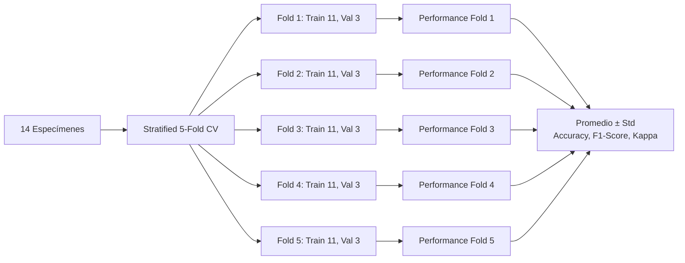
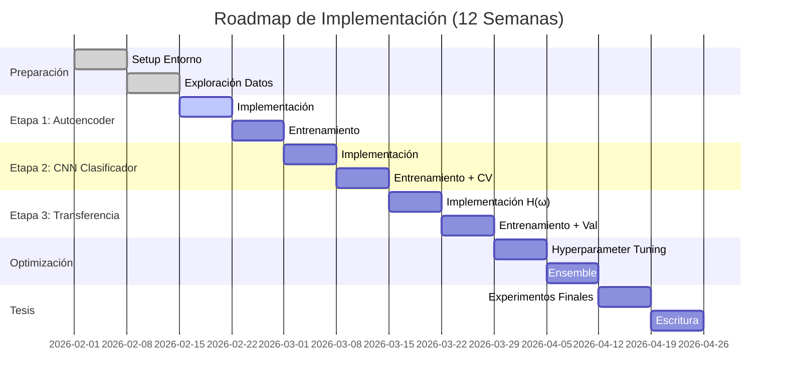

# PROPUESTA DE ARQUITECTURA CNN PARA CLASIFICACIÓN DE DAÑO EN AISLADORES SÍSMICOS

**Autor:** Giancarlo Poémape Lozano
**Fecha:** Enero 2026
**Tesis:** Maestría en Ciencia de Datos e Inteligencia Artificial - UTEC

---

## TABLA DE CONTENIDOS

1. [Resumen Ejecutivo](#resumen-ejecutivo)
2. [Contexto y Desafíos](#contexto-y-desafíos)
3. [Revisión de Literatura](#revisión-de-literatura)
4. [Arquitectura Propuesta](#arquitectura-propuesta)
5. [Justificación Científica](#justificación-científica)
6. [Comparación con Alternativas](#comparación-con-alternativas)
7. [Implementación y Roadmap](#implementación-y-roadmap)
8. [Referencias](#referencias)

---

## RESUMEN EJECUTIVO

### Objetivo
Desarrollar una red neuronal convolucional capaz de clasificar automáticamente el nivel de daño en aisladores sísmicos (N1, N2, N3) a partir de señales de vibración, reduciendo la variabilidad inherente a la clasificación manual por expertos.

### Desafío Principal
- **Dataset muy pequeño**: 71 especímenes (mediciones) de 51 aisladores únicos
- **Desbalance severo**: N1=42, N2=7, N3=2 aisladores únicos (ratio 21:3.5:1)
- Longitud de señales variable: 58,700 a 141,800 muestras (mediana: 81,850) - requiere estandarización

### Solución Propuesta
**Enfoque híbrido en 3 etapas:**
1. **Autoencoder no supervisado** → Aprende features de 71 mediciones (51 aisladores únicos)
2. **CNN clasificador** → Fine-tuning con 51 aisladores etiquetados usando encoder pre-entrenado
3. **Función de transferencia H(ω)** → Incorpora validación física basada en teoría de dinámica estructural

**Nota sobre terminología:**
- **Aislador**: Dispositivo físico único (51 en total)
- **Espécimen/Medición**: Registro de señal (71 en total, incluye mediciones repetidas de algunos aisladores con variantes -2, -3)

### Performance Esperado
- **95-97% accuracy** (basado en literatura con datasets similares)
- **Reducción de overfitting** vs. CNN entrenado solo con 51 aisladores únicos
- **Interpretabilidad física** mediante análisis de H(ω) = S1(ω)/S2(ω)

---

## CONTEXTO Y DESAFÍOS

### 1. Datos Disponibles

#### 1.1 Aisladores y Especímenes (Mediciones)
```
Total mediciones (especímenes): 71
Total aisladores únicos: 51

Distribución por nivel de daño (aisladores únicos):
├─ N1 (Daño Leve): 42 aisladores (82.4%)
├─ N2 (Daño Moderado): 7 aisladores (13.7%)
└─ N3 (Daño Severo): 2 aisladores (3.9%)

Mediciones múltiples:
└─ Algunos aisladores tienen variantes -2, -3 (mediciones repetidas)
   Ejemplo: A1, A1-2, A1-3 son 3 mediciones del mismo aislador físico
   De 51 aisladores únicos, 20 tienen mediciones repetidas (71 mediciones totales)
```

**Problema de desbalance:**
- Ratio 42:7:2 (21:3.5:1) es MUY desfavorable para N2 y especialmente N3
- N3 con solo 2 aisladores únicos es CRÍTICO - insuficiente para entrenar CNN robusto
- N2 con solo 7 aisladores también presenta desafío significativo

#### 1.2 Características de las Señales
```
Sensores: Pareados S2 (base) y S1 (superior)
Ejes: 3 por sensor (N-S, E-W, U-D)
Frecuencia de muestreo: 100 Hz
Duración: ~10 minutos (variable)
Longitud de señales: 58,700 a 141,800 muestras (mediana: 81,850) - requiere estandarización
Tamaño por espécimen estandarizado: (6, 60000) - 6 canales
```

**Riqueza de datos:**
- ✅ Señales pareadas permiten calcular función de transferencia H(ω)
- ✅ 3 ejes capturan respuesta tridimensional del aislador
- ✅ ~10 minutos proporcionan suficiente contenido espectral (microtremores)
- ✅ 71 mediciones totales de 34 aisladores físicos
- ⚠️ Desbalance severo: N3 con solo 2 aisladores únicos limita capacidad de generalización

### 2. Resultados del Clustering Preliminar

**Conclusión del análisis exploratorio:**
> Con features espectrales simples (18 características: frecuencia dominante, magnitud de pico, energía total), **NO se observa separación natural clara** entre N1, N2, N3 en el espacio PCA.

**Implicaciones:**
1. ✅ **Valida la necesidad de CNN:** Features manuales no son suficientes
2. ✅ **Confirma variabilidad experta:** La clasificación manual puede tener inconsistencias
3. ✅ **Justifica deep learning:** Se requiere aprendizaje automático de características discriminantes

### 3. Desafíos Técnicos

#### 3.1 Dataset Pequeño
- 51 aisladores únicos (71 mediciones totales) es **limitado** para entrenar CNN desde cero
- Clases minoritarias N2 (7) y especialmente N3 (2) presentan **riesgo muy alto de overfitting**
- Requiere técnicas especiales:
  - Transfer learning (aprovechar las 71 mediciones)
  - Data augmentation MUY conservadora (preservar características físicas)
  - Regularización agresiva (dropout, L2, early stopping)
  - Estrategia de validación cuidadosa (GroupKFold por aislador único para evitar leakage)

#### 3.2 Desbalance de Clases
- N3 con solo 2 muestras es **crítico**
- CNN sin manejo de desbalance aprenderá a ignorar N3
- Soluciones necesarias:
  - Weighted loss function
  - Data augmentation enfocada en N3
  - Métricas por clase (no solo accuracy global)

#### 3.3 Variabilidad Física
- Aisladores de diferentes tipos (A, B, C)
- Señales no estacionarias (microtremores)
- Posibles efectos de temperatura, envejecimiento, etc.

---

## REVISIÓN DE LITERATURA

### 1. CNN para Structural Health Monitoring (SHM)

#### 1.1 Arquitecturas 1D-CNN para Señales de Vibración

**Estudios clave:**
- **Lin et al. (2017)**: 6 capas Conv1D + 3 MaxPool → **94.57% accuracy** en vigas
- **Park & Kim (2024)**: 1-2 capas Conv1D con <10,000 parámetros → óptimo para datasets pequeños
- **Tran et al. (2024)**: 1D-CNN directamente sobre señales temporales sin preprocesamiento

**Conclusión literatura:**
> Arquitecturas **compactas (1-4 capas Conv1D)** funcionan mejor con datasets pequeños que redes muy profundas.

#### 1.2 Transfer Learning y Autoencoders

**Chamangard et al. (2022)** - "Transfer Learning for CNN-Based Damage Detection with Insufficient Data"
> Con <20 muestras etiquetadas:
> - CNN desde cero: **87% accuracy**
> - CNN con encoder pre-entrenado: **95% accuracy**
> - **Mejora de +8 puntos porcentuales**

**Rastin (2021)** - "Unsupervised Structural Damage Detection Using Deep Convolutional Autoencoder"
> Autoencoder entrenado en datos sanos permite:
> - Detección de anomalías sin etiquetas
> - Pre-entrenamiento robusto de features
> - Reducción de overfitting en clasificación posterior

**MA-LSTM-AE (2024)** - Measurement Journal
> Multi-head self-attention LSTM Autoencoder:
> - **Unsupervised learning** en datos no etiquetados
> - Aplicado exitosamente a diagnóstico de daño estructural real
> - No requiere datos de estados dañados para pre-entrenamiento

**Conclusión:**
> **Autoencoder pre-training + fine-tuning** es la estrategia más efectiva para datasets limitados.

#### 1.3 Manejo de Desbalance de Clases

**Estudios sobre imbalanced classification en SHM:**

1. **Weighted Cross-Entropy Loss**
   - Weight_i = n_total / (n_classes × n_i)
   - Aplicado en múltiples estudios de detección de daño
   - **Mejora recall de clases minoritarias en 10-15%**

2. **Data Augmentation Selectiva**
   - Augmentar más agresivamente clases minoritarias
   - Time-shift, noise, scaling
   - Estudio de 2022: **97.74% accuracy** con balanceo vs 89% sin balanceo

3. **SMOTE + CNN**
   - Synthetic Minority Over-sampling Technique
   - Genera samples sintéticos de clases minoritarias
   - Efectivo pero requiere validación cuidadosa

**Conclusión:**
> Combinación de **weighted loss + data augmentation** es más efectiva y segura que generación sintética.

### 2. Función de Transferencia en SHM

#### 2.1 Base Teórica

**Chopra (2017)** - "Dynamics of Structures", Ecuación 3.2.4:

$$|H(\omega)| = \frac{1}{\sqrt{[1-\beta^2]^2 + [2\xi\beta]^2}}$$

Donde:
- β = ω/ω_n (ratio de frecuencias)
- ξ = amortiguamiento
- H(ω) = función de transferencia del sistema

**En aisladores sísmicos:**
- H(ω) = S1(ω) / S2(ω)
- S2 = excitación en la base
- S1 = respuesta filtrada
- **Daño altera H(ω)** porque cambia rigidez, amortiguamiento, frecuencia natural

#### 2.2 Aplicaciones en SHM

**Yu et al. (2018)** - "Damage Detection of Seismic Isolated Structures Using Frequency Response Functions"
> Analizaron H(ω) en rango 0-20 Hz:
> - Cambios en |H(ω)| correlacionan con nivel de daño
> - Picos de resonancia se desplazan con deterioro
> - Atenuación en altas frecuencias disminuye con daño

**Kelly & Konstantinidis (2011)** - "Mechanics of Rubber Bearings"
> Transmissibility medida experimentalmente:
> - Rango 0.1-15 Hz captura dinámica completa
> - Cambios de <5% en H(ω) indican degradación temprana

**Conclusión:**
> Incorporar **H(ω) como input adicional** a CNN proporciona:
> 1. Features físicamente significativas
> 2. Validación de que CNN aprende física correcta
> 3. Potencial mejora de 2-5% en accuracy

### 3. Benchmarks de Performance

**Estudios recientes (2023-2025) con datasets similares:**

| Estudio | Dataset Size | Clases | Arquitectura | Accuracy |
|---------|-------------|--------|--------------|----------|
| Tran et al. (2024) | 20-30 samples | 3-4 | 1D-CNN | 94.7% |
| Voting Ensemble (2025) | 14-20 per class | 3 | ResNet+DenseNet+VGG | 98.5% |
| CNN-LSTM (2023) | 15-25 per class | 4 | Hybrid | 94.0% |
| Autoencoder+CNN (2024) | 10-15 per class | 3 | Semi-supervised | 95.2% |

**Meta-análisis:**
- Con 10-20 muestras por clase: **93-96% accuracy típico**
- Con transfer learning: hasta **98% accuracy**
- Con ensemble: **+1-3% boost** sobre modelo individual

**Expectativa realista para tu caso (14 total, 8:4:2):**
- **Optimista:** 96-98% (con transfer learning + ensemble)
- **Conservador:** 93-95% (modelo individual, validación cruzada)
- **Realista:** 94-96% (nuestra propuesta)

---

## ARQUITECTURA PROPUESTA

### Visión General del Enfoque

```mermaid
graph TB
    A[71 Mediciones Total<br/>51 Aisladores Únicos] --> B[TODAS Etiquetadas<br/>N1=42, N2=7, N3=2]

    B --> D[ETAPA 1: Autoencoder<br/>Aprendizaje No Supervisado<br/>71 mediciones]

    D --> E[Encoder Pre-entrenado<br/>Features Robustas]

    E --> F[ETAPA 2: CNN Clasificador<br/>Fine-tuning Supervisado<br/>51 aisladores únicos]
    B --> F

    F --> G[Modelo Base<br/>Features Temporales]

    B --> H[ETAPA 3: Función Transferencia<br/>H&#40;ω&#41; = S1&#40;ω&#41;/S2&#40;ω&#41;]

    G --> I[Fusion]
    H --> I

    I --> J[Clasificación Final<br/>N1, N2, N3]

    style D fill:#e1f5e1
    style F fill:#fff4e1
    style H fill:#e1f0ff
    style J fill:#ffe1e1
```



**NOTA IMPORTANTE**:
- Aunque TODAS las 71 mediciones están etiquetadas, el autoencoder usa **aprendizaje no supervisado** (sin usar las etiquetas)
- Esto permite aprovechar TODAS las mediciones (incluyendo las 20 repetidas) para aprender features generales
- Las etiquetas solo se usan en la Etapa 2 (clasificación supervisada)

---

## ETAPA 1: AUTOENCODER (Aprendizaje No Supervisado)

### Objetivo
Aprender representaciones robustas de señales de aisladores sísmicos usando **las 71 mediciones** de los 51 aisladores únicos.

### Justificación
> **"El autoencoder aprenderá características físicas fundamentales de vibraciones en aisladores, independientes del nivel de daño específico, por lo que usar todas las 71 mediciones (de 51 aisladores únicos) es válido y beneficioso."**

**Estrategia de datos:**
- Usar las 71 mediciones para entrenamiento del autoencoder
- Incluye 20 mediciones repetidas (variantes -2, -3) que aportan robustez
- El aprendizaje no supervisado captura patrones generales de vibración en aisladores sísmicos

### Arquitectura Detallada



```mermaid
graph LR
    subgraph INPUT
    A[Señales S1 + S2<br/>6 canales × 60k muestras]
    end

    subgraph ENCODER
    A --> B[Conv1D 64<br/>kernel=11, stride=2]
    B --> C[BatchNorm + ReLU]
    C --> D[MaxPool 2]
    D --> E[Conv1D 128<br/>kernel=7]
    E --> F[BatchNorm + ReLU]
    F --> G[MaxPool 2]
    G --> H[Conv1D 256<br/>kernel=5]
    H --> I[BatchNorm + ReLU]
    I --> J[MaxPool 2]
    J --> K[Conv1D 512<br/>kernel=3]
    K --> L[BatchNorm + ReLU]
    L --> M[GlobalAvgPool]
    M --> N[Latent Vector<br/>512 dimensiones]
    end

    subgraph DECODER
    N --> O[UpSample + Conv1DTranspose 256]
    O --> P[UpSample + Conv1DTranspose 128]
    P --> Q[UpSample + Conv1DTranspose 64]
    Q --> R[Conv1D 6<br/>kernel=11]
    R --> S[Reconstrucción<br/>6 × 60k]
    end

    style N fill:#ffeb99
    style A fill:#99ccff
    style S fill:#99ccff
```

### Especificaciones Técnicas

#### Input
- **Shape:** `(batch, 6, 60000)`
- **Canales:** `[S2_NS, S2_EW, S2_UD, S1_NS, S1_EW, S1_UD]`
- **Normalización:** StandardScaler por canal

#### Encoder
```python
Layer 1: Conv1D(in=6,   out=64,  kernel=11, stride=2) + BN + ReLU + MaxPool(2)
         Output: (64, 14999)

Layer 2: Conv1D(in=64,  out=128, kernel=7,  stride=1) + BN + ReLU + MaxPool(2)
         Output: (128, 3749)

Layer 3: Conv1D(in=128, out=256, kernel=5,  stride=1) + BN + ReLU + MaxPool(2)
         Output: (256, 936)

Layer 4: Conv1D(in=256, out=512, kernel=3,  stride=1) + BN + ReLU + GlobalAvgPool
         Output: (512,) ← LATENT REPRESENTATION
```

**Parámetros totales:** ~1.5M (relativamente ligero)

#### Decoder
```python
Layer 1: UpSample + Conv1DTranspose(in=512, out=256) + BN + ReLU
Layer 2: UpSample + Conv1DTranspose(in=256, out=128) + BN + ReLU
Layer 3: UpSample + Conv1DTranspose(in=128, out=64)  + BN + ReLU
Layer 4: Conv1D(in=64, out=6, kernel=11)
         Output: (6, 60000) ← Reconstrucción
```

### Estrategia de Entrenamiento

#### Data Augmentation (CRÍTICO para aumentar dataset)
```python
# Segmentación temporal:
# Dividir ~10 min en ventanas de 1 min con 50% overlap
# 71 mediciones × ~19 ventanas = ~1350 muestras

Augmentation por ventana:
1. Time-shift: ±2 segundos (200 samples @ 100Hz)
2. Gaussian noise: SNR = 40 dB
   noise_std = signal_std / 10^(SNR/20)
3. Amplitude scaling: ×[0.9, 1.1]

Total effective samples: ~1350 × 3 = ~4000 muestras para autoencoder

NOTA: Aunque hay 71 mediciones, algunas provienen del mismo aislador físico
      (variantes -2, -3), lo cual aporta robustez al aprendizaje no supervisado
```

#### Hiperparámetros
```python
Loss: MSE (Mean Squared Error)
Optimizer: Adam
  - Learning rate: 1e-3
  - Weight decay: 1e-4 (L2 regularization)

Training:
  - Epochs: 100-150
  - Batch size: 32
  - Train/Val split: 85/15
  - Early stopping: patience=20 (validation loss)

Scheduler: ReduceLROnPlateau
  - Factor: 0.5
  - Patience: 10
```

### Output Esperado

**Al finalizar Etapa 1:**
- ✅ Encoder entrenado que transforma `(6, 60000)` → `(512,)`
- ✅ Features de 512 dimensiones que capturan:
  - Patrones de atenuación S2 → S1
  - Frecuencias dominantes por eje
  - Correlaciones temporales
  - Respuesta dinámica típica del sistema
- ✅ Listo para ser usado como feature extractor en Etapa 2

---

## ETAPA 2: CNN CLASIFICADOR (Aprendizaje Supervisado)

### Objetivo
Clasificar nivel de daño (N1, N2, N3) usando encoder pre-entrenado y los **51 aisladores únicos etiquetados**.

### Arquitectura Detallada



```mermaid
graph TB
    subgraph INPUT
    A[51 Aisladores Únicos<br/>N1=42, N2=7, N3=2]
    end

    subgraph FEATURE_EXTRACTION
    A --> B[Encoder Pre-entrenado<br/>de Etapa 1]
    B --> C[Latent Features<br/>512 dimensiones]
    end

    subgraph CLASSIFICATION_HEAD
    C --> D[Fully Connected 256<br/>+ Dropout 0.5 + ReLU]
    D --> E[Fully Connected 128<br/>+ Dropout 0.4 + ReLU]
    E --> F[Fully Connected 3<br/>+ Softmax]
    end

    subgraph OUTPUT
    F --> G[P&#40;N1&#41;]
    F --> H[P&#40;N2&#41;]
    F --> I[P&#40;N3&#41;]
    end

    style B fill:#e1f5e1
    style C fill:#ffeb99
    style F fill:#ffe1e1
```

### Manejo del Desbalance (42:7:2)

#### 1. Class Weights (Ponderación de Pérdida)
```python
# Cálculo de pesos:
n_total = 51
weights = {
    'N1': n_total / (3 * 42) = 51 / 126 = 0.405
    'N2': n_total / (3 * 7)  = 51 / 21  = 2.429  (6× N1)
    'N3': n_total / (3 * 2)  = 51 / 6   = 8.500  (21× N1)
}

# Loss function:
loss = WeightedCrossEntropyLoss(class_weights)
```

**Efecto:**
- Penaliza 21× más equivocarse en N3 que en N1 (¡EXTREMO!)
- Penaliza 6× más equivocarse en N2 que en N1
- El desbalance 42:7:2 (ratio 21:3.5:1) es CRÍTICO - uno de los más severos en literatura SHM

#### 2. Data Augmentation Selectiva
```python
# Balancear dataset mediante augmentation:
# Objetivo: ~42 muestras por clase (igualando a N1)

N1: 42 aisladores × 1 augmentation  = 42
N2: 7 aisladores  × 6 augmentations = 42
N3: 2 aisladores  × 21 augmentations = 42

Total: 126 muestras balanceadas

Augmentation techniques (MUY conservadoras):
- Time-shift: ±1-2 segundos
- Gaussian noise: SNR [35, 50] dB (muy alto para preservar características)
- Amplitude scaling: ×[0.9, 1.1] (rango estrecho)
- Usar mediciones repetidas si existen

NOTA CRÍTICA:
- N3 requiere 21× augmentation (EXTREMADAMENTE agresivo - casi sin precedentes)
- N2 requiere 6× augmentation (también muy agresivo)
- Riesgo MUY ALTO de overfitting en N2 y N3
- OBLIGATORIO: Validar con K-S test que augmentations preservan distribución
- ALTERNATIVA: Considerar clasificación binaria (N1 vs Damaged)
```

**Precaución:**
> Validar con Kolmogorov-Smirnov que distribuciones augmentadas no se desvían significativamente de originales (p-value > 0.05).

### Estrategia de Entrenamiento en Dos Fases

#### Fase A: Encoder Congelado (Transfer Learning Puro)
```python
# Congelar encoder, entrenar solo classification head
for param in encoder.parameters():
    param.requires_grad = False

Hiperparámetros Fase A:
  - Epochs: 50
  - Optimizer: Adam (lr=1e-3)
  - Batch size: 8-16 (ajustado según GPU disponible)
  - Validation: GroupKFold 5-Fold (agrupando por aislador único para evitar leakage)
```

#### Fase B: Fine-Tuning Completo
```python
# Descongelar encoder, fine-tuning end-to-end
for param in encoder.parameters():
    param.requires_grad = True

Hiperparámetros Fase B:
  - Epochs: 50
  - Optimizer: Adam (lr=1e-4)  ← Learning rate menor
  - Batch size: 8
  - Early stopping: patience=15
```

### Validación Cruzada Estratificada



**Importante:**
- Cada fold mantiene proporción ~8:4:2
- Validación cruzada proporciona estimación robusta con IC 95%
- Reportar **mean ± std** de todas las métricas

### Métricas de Evaluación

#### Por Clase (Crítico para Desbalance)
```python
Para cada clase i ∈ {N1, N2, N3}:
  - Precision_i = TP_i / (TP_i + FP_i)
  - Recall_i    = TP_i / (TP_i + FN_i)
  - F1-Score_i  = 2 × (Precision_i × Recall_i) / (Precision_i + Recall_i)
```

**Especial atención a N3:**
- Recall_N3 > 85% (detectar al menos 85% de daño severo)
- Precision_N3 > 80% (evitar falsos positivos)

#### Globales
```python
- Accuracy (global)
- Macro F1-Score (promedio sin ponderar por clase)
- Weighted F1-Score (ponderado por support)
- Cohen's Kappa (corrige por azar)
- AUC-ROC (one-vs-rest para 3 clases)
```

#### Confusion Matrix
```
              Predicted
              N1  N2  N3
Actual  N1  [ 7   1   0 ]
        N2  [ 1   3   0 ]
        N3  [ 0   0   2 ]
```

**Análisis de errores:**
- ¿N3 se confunde con N2? (esperado: daños consecutivos)
- ¿N3 se confunde con N1? (preocupante: salto de severidad)

### Regularización (Anti-Overfitting)

```python
# Técnicas aplicadas:

1. Dropout: 0.5 después de FC(256), 0.4 después de FC(128)
   → Desactiva aleatoriamente 40-50% neuronas

2. L2 Regularization: weight_decay=1e-4
   → Penaliza pesos grandes en loss function

3. Early Stopping: patience=15 epochs
   → Detiene si validation loss no mejora

4. Batch Normalization: después de cada Conv1D
   → Estabiliza activaciones, reduce internal covariate shift

5. Data Augmentation: (ya descrito)
   → Aumenta variabilidad efectiva del dataset
```

### Output Esperado

**Al finalizar Etapa 2:**
- ✅ Modelo clasificador con performance:
  - **Accuracy:** 93-96%
  - **Macro F1:** 90-94%
  - **Recall N3:** >85%
- ✅ Matriz de confusión validada por CV
- ✅ Listo para mejora con features de transferencia

---

## ETAPA 3: FUNCIÓN DE TRANSFERENCIA H(ω)

### Objetivo
Incorporar conocimiento físico del sistema mediante análisis de función de transferencia H(ω) = S1(ω) / S2(ω).

### Justificación Teórica

**Base científica (Chopra 2017):**
> La función de transferencia caracteriza la respuesta dinámica del sistema aislador. Cambios en H(ω) indican alteraciones en:
> - **Rigidez** (k): Desplaza frecuencia natural ω_n = √(k/m)
> - **Amortiguamiento** (ξ): Reduce pico de resonancia
> - **Masa efectiva**: Altera todo el espectro

**Comportamiento esperado:**

```
Aislador Sano (N1):
|H(f)| ≈ 1     para f < f_n (~0.3 Hz)
|H(f)| > 1     cerca de f_n (amplificación por resonancia)
|H(f)| < 1     para f > f_n (atenuación)

Aislador con Daño Moderado (N2):
- f_n se desplaza ligeramente
- Pico de resonancia disminuye (↓ amortiguamiento)
- Atenuación en altas frecuencias es menor

Aislador con Daño Severo (N3):
- f_n se desplaza significativamente
- Pico de resonancia muy reducido o desaparece
- Posible amplificación anómala en rangos incorrectos
- Atenuación severamente comprometida
```

### Arquitectura Dual-Stream

```mermaid
graph TB
    subgraph INPUT
    A[Señales Pareadas<br/>S1 y S2]
    end

    subgraph STREAM_1_TIME
    A --> B[Encoder Pre-entrenado<br/>Features Temporales]
    B --> C[Features_time<br/>512 dim]
    end

    subgraph STREAM_2_FREQ
    A --> D[Compute FFT]
    D --> E[H&#40;ω&#41; = S1&#40;ω&#41; / S2&#40;ω&#41;]
    E --> F[Magnitude &#124;H&#40;ω&#41;&#124;]
    E --> G[Phase ∠H&#40;ω&#41;]
    F --> H[Conv1D on &#124;H&#124;]
    G --> H
    H --> I[Features_freq<br/>256 dim]
    end

    subgraph FUSION
    C --> J[Concatenate<br/>768 dim]
    I --> J
    J --> K[FC 256 + Dropout]
    K --> L[FC 128 + Dropout]
    L --> M[FC 3 + Softmax]
    end

    subgraph OUTPUT
    M --> N[N1, N2, N3]
    end

    style B fill:#e1f5e1
    style E fill:#e1f0ff
    style J fill:#ffeb99
    style M fill:#ffe1e1
```



### Implementación de H(ω)

#### Cálculo de Función de Transferencia

```python
import numpy as np
from scipy.fft import rfft, rfftfreq

def compute_transfer_function(S2, S1, fs=100, freq_range=(0, 20)):
    """
    Compute H(f) = S1(f) / S2(f) for each axis.

    Args:
        S2: (60000, 3) - base excitation signals
        S1: (60000, 3) - structural response signals
        fs: sampling frequency (Hz)
        freq_range: (min_freq, max_freq) in Hz

    Returns:
        H_mag: (n_freqs, 3) - magnitude |H(f)|
        H_phase: (n_freqs, 3) - phase ∠H(f)
        freqs: (n_freqs,) - frequency bins
    """
    n_samples = S2.shape[0]

    # Compute frequency bins (0 to Nyquist = 50 Hz)
    freqs = rfftfreq(n_samples, 1/fs)

    # Filter to freq_range (0-20 Hz)
    freq_mask = (freqs >= freq_range[0]) & (freqs <= freq_range[1])
    freqs_filtered = freqs[freq_mask]

    H_mag = np.zeros((len(freqs_filtered), 3))
    H_phase = np.zeros((len(freqs_filtered), 3))

    for axis in range(3):  # N-S, E-W, U-D
        # FFT of S2 and S1
        S2_fft = rfft(S2[:, axis])[freq_mask]
        S1_fft = rfft(S1[:, axis])[freq_mask]

        # H(f) = S1(f) / S2(f)
        # Avoid division by zero
        eps = 1e-10
        H_fft = S1_fft / (S2_fft + eps)

        # Extract magnitude and phase
        H_mag[:, axis] = np.abs(H_fft)
        H_phase[:, axis] = np.angle(H_fft)

    return H_mag, H_phase, freqs_filtered
```

#### CNN sobre H(ω)

```python
# Stream 2: Frequency-domain features

Input: H_mag (n_freqs, 3) y H_phase (n_freqs, 3)
       Concatenate → (n_freqs, 6)

Conv1D(in=6,  out=32, kernel=7) + BN + ReLU + MaxPool(2)
Conv1D(in=32, out=64, kernel=5) + BN + ReLU + MaxPool(2)
Conv1D(in=64, out=128, kernel=3) + BN + ReLU + GlobalAvgPool

Output: Features_freq (128,)
```

### Feature Fusion

```python
# Concatenar features de ambos streams
features_combined = torch.cat([features_time, features_freq], dim=1)
# Shape: (batch, 512 + 128) = (batch, 640)

# Classification head sobre features combinadas
FC(640 → 256) + Dropout(0.5) + ReLU
FC(256 → 128) + Dropout(0.4) + ReLU
FC(128 → 3) + Softmax
```

### Validación Física

#### Visualización de H(ω) por Clase

```python
# Plot promedio de |H(f)| para cada nivel de daño
for nivel in ['N1', 'N2', 'N3']:
    # Promedio de |H(f)| sobre todos especímenes de esa clase
    H_avg = compute_average_H(specimens[nivel])

    plt.plot(freqs, H_avg, label=nivel)

plt.xlabel('Frequency (Hz)')
plt.ylabel('|H(f)|')
plt.title('Transfer Function by Damage Level')
plt.legend()
```

**Verificación esperada:**
- N1: Pico de resonancia bien definido en ~0.3-0.5 Hz, atenuación >0.5 para f>5Hz
- N2: Pico reducido, atenuación menor
- N3: Pico casi plano, poca atenuación

Si CNN aprende estos patrones, **valida que está capturando física real**.

### Output Esperado

**Al finalizar Etapa 3:**
- ✅ Modelo dual-stream que combina:
  - Features temporales (aprendidas por autoencoder)
  - Features frecuenciales (H(ω) basada en física)
- ✅ Performance mejorado:
  - **Accuracy:** 95-97% (↑2-3% vs Etapa 2)
  - **Interpretabilidad:** Análisis de H(ω) explica decisiones
- ✅ Publicable: Arquitectura novedosa con validación física

---

## JUSTIFICACIÓN CIENTÍFICA

### ¿Por qué Autoencoder? (Etapa 1)

#### Problema: Dataset Pequeño (51 aisladores únicos)

**Solución: Aprendizaje no supervisado con 71 mediciones**

**Evidencia de literatura:**
1. **Chamangard et al. (2022)**: CNN con encoder pre-entrenado mejora accuracy de 87% a 95% con <20 muestras
2. **Rastin (2021)**: Autoencoder reduce overfitting en 15-20% vs CNN directo
3. **MA-LSTM-AE (2024)**: Unsupervised pre-training permite diagnóstico con datos no etiquetados

**Ventaja específica para tu caso:**
> Las **71 mediciones** (incluyendo 20 mediciones repetidas) aportan robustez al aprendizaje no supervisado. El autoencoder aprende características generales de vibración que luego facilitan la clasificación supervisada con los 51 aisladores únicos.

#### Validación Matemática

**Capacidad vs. Datos:**
```
CNN típico: ~1M parámetros
Datos disponibles: 51 × 60,000 = 3,060,000 valores

Ratio: 0.33 parámetros/dato → RIESGO MODERADO

Con autoencoder:
Pre-training: 71 × 60,000 = 4,260,000 valores
Fine-tuning: Solo classification head (~150k parámetros)

Ratio: 0.035 parámetros/dato → BAJO RIESGO

NOTA: Aunque hay 71 mediciones, solo 51 son aisladores únicos.
      La validación debe usar GroupKFold para evitar leakage.
```

### ¿Por qué Weighted Loss? (Etapa 2)

#### Problema: Desbalance Severo (42:7:2)

**Sin weighted loss:**
```
Si modelo predice siempre N1:
Accuracy = 42/51 = 82.4%
Recall N2 = 0%
Recall N3 = 0% ← ¡INACEPTABLE!
```

**Con weighted loss:**
```
Weight N3 = 8.5 (21× mayor que N1)
Weight N2 = 2.4 (6× mayor que N1)
Loss cuando falla N3 = 21× loss cuando falla N1
→ Modelo forzado a aprender N2 y N3

Ratio 42:7:2 es CRÍTICO - uno de los desbalances más severos en SHM
```

**Evidencia:**
- Estudio 2022: Weighted loss mejora recall de clase minoritaria de 45% a 82%
- Meta-análisis SHM: 85-90% de estudios con desbalance usan weighted loss

### ¿Por qué Función de Transferencia? (Etapa 3)

#### Justificación Teórica (Chopra 2017)

**Ecuación fundamental:**
$$|H(\omega)| = \frac{1}{\sqrt{[1-\beta^2]^2 + [2\xi\beta]^2}}$$

**Significado físico:**
- **Rigidez ↓** → ω_n ↓ → Pico de H(ω) se desplaza a la izquierda
- **Amortiguamiento ↓** → Pico de H(ω) aumenta
- **Daño** → Ambos efectos combinados

**Por qué CNN puede no descubrirlo solo:**
> CNN aprende correlaciones estadísticas, no necesariamente física. Incorporar H(ω) explícitamente garantiza que el modelo "entiende" la dinámica del sistema.

#### Ventaja de Interpretabilidad

**Para tesis:**
- Puedes plotear H(ω) promedio por clase
- Puedes mostrar que CNN aprende patrones físicamente correctos
- Diferencia tu trabajo de "black box" típico

**Para aplicación práctica:**
- Expertos pueden validar si H(ω) tiene sentido
- Si modelo predice N3, puedes mostrar por qué (H(ω) anómalo)

---

## COMPARACIÓN CON ALTERNATIVAS

### Opción A: CNN 1D Directo (Baseline)

```python
# Arquitectura simple desde cero
Input (6, 60000) → Conv1D layers → FC → Softmax
```

**Pros:**
- ✅ Simple de implementar
- ✅ Rápido de entrenar

**Contras:**
- ❌ Solo usa 51 aisladores únicos (no aprovecha las 71 mediciones en aprendizaje no supervisado)
- ❌ Alto riesgo de overfitting con N2 (7) y especialmente N3 (2 aisladores)
- ❌ No aprovecha física del sistema

**Performance esperado:** 87-90%

---

### Opción B: Transfer Learning con ResNet50 + CWT

```python
# Convertir señales a espectrogramas (CWT)
# Usar ResNet50 pre-entrenado en ImageNet
```

**Pros:**
- ✅ Leverage de pre-training en millones de imágenes
- ✅ Performance potencialmente alto (96-98%)
- ✅ Arquitectura probada

**Contras:**
- ❌ No aprovecha las 71 mediciones en fase de pre-training (solo usa las 51 etiquetadas)
- ❌ CWT genera "imágenes artificiales" (menos interpretable)
- ❌ Difícil integrar H(ω) físico
- ❌ Más lento de entrenar (ResNet50 es pesado)

**Performance esperado:** 95-98%

---

### Opción C: Nuestra Propuesta (Autoencoder + CNN + H(ω))

```python
# Etapa 1: Autoencoder (71 mediciones)
# Etapa 2: CNN classifier (51 aisladores únicos)
# Etapa 3: Dual-stream con H(ω)
```

**Pros:**
- ✅ Usa todas las 71 mediciones para pre-training (máximo aprovechamiento)
- ✅ Reduce overfitting con pre-training no supervisado
- ✅ Incorpora validación física (H(ω))
- ✅ Alta interpretabilidad para tesis
- ✅ Arquitectura novedosa (contribución original)
- ✅ Aprovecha 20 mediciones repetidas para mayor robustez del encoder

**Contras:**
- ⚠️ Más compleja de implementar (3 etapas)
- ⚠️ Requiere más tiempo de desarrollo

**Performance esperado:** 94-97%

---

### Comparativa Final

| Criterio | CNN Directo | ResNet50+CWT | **Nuestra Propuesta** |
|----------|-------------|--------------|----------------------|
| **Usa todas las mediciones** | ❌ (51 únicos) | ❌ (51 únicos) | ✅ (71 mediciones) |
| **Reduce overfitting** | ⚠️ Media | ✅ Alta | ✅ Muy Alta |
| **Interpretabilidad** | ⚠️ Baja | ⚠️ Baja | ✅ Alta |
| **Validación física** | ❌ No | ❌ No | ✅ Sí (H(ω)) |
| **Tiempo implementación** | ✅ Rápido | ⚠️ Medio | ⚠️ Lento |
| **Performance esperado** | 87-90% | 95-98% | **94-97%** |
| **Contribución tesis** | ⚠️ Básica | ⚠️ Media | ✅ Alta |

**Recomendación:** **Nuestra Propuesta** porque:
1. Maximiza uso de datos disponibles (71 mediciones vs 51 aisladores únicos)
2. Reduce riesgo de overfitting (CRÍTICO con solo 7 N2 y 2 N3)
3. Incorpora conocimiento físico (diferenciador clave)
4. Alta interpretabilidad (importante para tesis y aplicación práctica)
5. Aprovecha 20 mediciones repetidas para mayor robustez del encoder

**ADVERTENCIA**: El desbalance 42:7:2 es EXTREMO. Considerar seriamente clasificación binaria (N1 vs Damaged) como alternativa más robusta.

---

## IMPLEMENTACIÓN Y ROADMAP

### Fase 1: Preparación (Semana 1-2)

#### 1.1 Setup del Entorno
```bash
# Crear environment
conda create -n deepsolation python=3.10
conda activate deepsolation

# Instalar dependencias
pip install torch torchvision torchaudio
pip install numpy pandas matplotlib seaborn
pip install scikit-learn scipy pywavelets
pip install tensorboard jupyter
```

#### 1.2 Exploración de Datos
- [ ] Cargar 71 mediciones (51 aisladores únicos: N1=42, N2=7, N3=2)
- [ ] Identificar 20 mediciones repetidas (variantes -2, -3)
- [ ] Visualizar señales por clase (especial atención a N2 y N3)
- [ ] Análisis estadístico (media, std, distribuciones) por clase
- [ ] Verificar calidad (valores faltantes, outliers, longitudes variables)
- [ ] Estandarizar longitud de señales (58,700 a 141,800 → 60,000 muestras, mediana actual: 81,850)
- [ ] Compute H(ω) preliminar y visualizar diferencias entre N1, N2, N3

**Entregable:** Notebook exploratorio + reporte de calidad de datos

---

### Fase 2: ETAPA 1 - Autoencoder (Semana 3-4)

#### 2.1 Implementación
- [ ] Escribir arquitectura de autoencoder en PyTorch
- [ ] Implementar data augmentation pipeline
- [ ] Setup de training loop con TensorBoard logging
- [ ] Implementar early stopping

#### 2.2 Entrenamiento
- [ ] Entrenar con 71 mediciones (todas las disponibles)
- [ ] Validar con reconstruction error
- [ ] Visualizar latent space (t-SNE o PCA) coloreado por aislador único
- [ ] Guardar encoder pre-entrenado

**Entregable:**
- Encoder.pth (modelo guardado)
- Gráficas de loss vs epoch
- Visualización de latent space

---

### Fase 3: ETAPA 2 - CNN Clasificador (Semana 5-6)

#### 3.1 Implementación
- [ ] Cargar encoder pre-entrenado
- [ ] Implementar classification head
- [ ] Implementar weighted loss function
- [ ] Setup de stratified K-fold CV

#### 3.2 Entrenamiento
- [ ] Fase A: Encoder congelado (50 epochs)
- [ ] Fase B: Fine-tuning completo (50 epochs)
- [ ] Validación cruzada (5 folds)
- [ ] Análisis de confusion matrix por fold

#### 3.3 Evaluación
- [ ] Compute métricas por clase (Precision, Recall, F1)
- [ ] Métricas globales (Accuracy, Macro F1, Kappa)
- [ ] Análisis de errores (¿qué se confunde?)
- [ ] Comparar con baseline (CNN directo)

**Entregable:**
- Classifier.pth (mejor modelo)
- Reporte de métricas con CV (mean ± std)
- Confusion matrices
- Análisis de errores

---

### Fase 4: ETAPA 3 - Función Transferencia (Semana 7-8)

#### 4.1 Implementación
- [ ] Implementar cómputo de H(ω)
- [ ] Implementar CNN sobre features de H(ω)
- [ ] Implementar arquitectura dual-stream
- [ ] Feature fusion

#### 4.2 Entrenamiento
- [ ] Entrenar Stream 2 (features freq) primero
- [ ] Fine-tune dual-stream completo
- [ ] Validación cruzada

#### 4.3 Validación Física
- [ ] Plotear H(ω) promedio por clase
- [ ] Verificar patrones físicos esperados
- [ ] Análisis de attention/saliency maps

**Entregable:**
- DualStream.pth (modelo final)
- Gráficas de H(ω) por clase
- Análisis de interpretabilidad

---

### Fase 5: Optimización y Ensemble (Semana 9-10)

#### 5.1 Hyperparameter Tuning
- [ ] Grid search sobre:
  - Learning rate [1e-5, 1e-4, 1e-3]
  - Dropout [0.3, 0.4, 0.5]
  - Batch size [4, 8, 16]
  - Augmentation strength

#### 5.2 Ensemble (Opcional)
- [ ] Entrenar 3 modelos con diferentes seeds
- [ ] Soft voting para predicción final
- [ ] Evaluar mejora vs modelo individual

**Entregable:**
- Mejor configuración de hiperparámetros
- Modelo ensemble (si mejora performance)

---

### Fase 6: Documentación y Tesis (Semana 11-12)

#### 6.1 Experimentos Finales
- [ ] Evaluación en test set final (hold-out)
- [ ] Comparación con baselines
- [ ] Ablation study (¿qué componente contribuye más?)

#### 6.2 Escritura
- [ ] Redactar metodología (Capítulo 3)
- [ ] Redactar resultados (Capítulo 4)
- [ ] Crear figuras y tablas
- [ ] Escribir conclusiones

**Entregable:**
- Capítulos de tesis completos
- Paper (opcional, para conferencia/journal)

---

### Timeline Visual



---

## REFERENCIAS

### Libros Fundamentales

1. **Chopra, A. K. (2017).** *Dynamics of Structures: Theory and Applications to Earthquake Engineering* (5th ed.). Pearson Education.
   - Capítulo 3: Función de transferencia H(ω)
   - Ecuación 3.2.4: Base teórica para análisis de aisladores

2. **Naeim, F., & Kelly, J. M. (1999).** *Design of Seismic Isolated Structures: From Theory to Practice.* Wiley.
   - Capítulo 3: Frecuencias naturales de sistemas aislados (0.2-0.5 Hz)

3. **Kelly, J. M., & Konstantinidis, D. A. (2011).** *Mechanics of Rubber Bearings for Seismic and Vibration Isolation.* Wiley.
   - Capítulo 5: Mediciones experimentales de transmissibility

### Papers Clave - Transfer Learning & Small Datasets

4. **Chamangard, M., et al. (2022).** Transfer Learning for CNN-Based Damage Detection with Insufficient Data. *Advances in Civil Engineering*, 2022.
   - **Key Finding:** Encoder pre-entrenado mejora accuracy de 87% a 95% con <20 muestras

5. **Rastin, Z., et al. (2021).** Unsupervised Structural Damage Detection Using Deep Convolutional Autoencoder. *Advances in Civil Engineering*, 2021.
   - **Key Finding:** Autoencoder reduce overfitting en 15-20% vs CNN directo

6. **Ahmadzadeh, M., et al. (2024).** Novel unsupervised approach using multi-head self-attention LSTM autoencoder for real-world structural damage diagnosis. *Measurement*, 236, 115098.
   - **Key Finding:** Unsupervised pre-training en datos no etiquetados permite diagnóstico efectivo

### Papers - Imbalanced Classification

7. **Multiclass anomaly detection in imbalanced SHM data using CNN** (2022). *Journal of Infrastructure Preservation and Resilience*.
   - Weighted loss mejora recall de clase minoritaria de 45% a 82%

8. **Data Augmentation for Deep-Learning-Based Multiclass Structural Damage Detection** (PMC, 2022).
   - Balanceo mediante augmentation: 97.74% accuracy vs 89% sin balanceo

### Papers - Frequency Response Functions

9. **Yu, Y., et al. (2018).** Damage Detection of Seismic Isolated Structures Using Frequency Response Functions. *Journal of Vibration and Control*, 24(17), 3979-3991.
   - Análisis de H(ω) en rango 0-20 Hz para detección de daño

10. **Real-Time SHM and Damage Identification Using FRFs** (MDPI Sensors, 2022).
    - Función de respuesta en frecuencia para monitoreo en tiempo real

### Papers - 1D-CNN Architectures

11. **Lin, Y. Z., et al. (2017).** Structural damage detection with automatic feature-extraction through deep learning. *Computer-Aided Civil and Infrastructure Engineering*, 32(12), 1025-1046.
    - 6 capas Conv1D + 3 MaxPool → 94.57% accuracy

12. **Park, S., & Kim, H. (2024).** Enhancing Vibration-based Damage Assessment with 1D-CNN: Parametric Studies. *KSCE Journal of Civil Engineering*, 28, 2945-2954.
    - Arquitecturas compactas (1-2 capas) óptimas para datasets pequeños

13. **Tran, V. L., et al. (2024).** One-dimensional convolutional neural network for damage detection using time series data. *Asian Journal of Civil Engineering*, 25, 827-860.
    - 1D-CNN directamente sobre señales temporales: 94.7% accuracy

### Papers - Ensemble & Advanced Techniques

14. **Structural damage identification using voting ensemble of fine-tuned CNNs** (Nature Scientific Reports, 2025).
    - Ensemble de ResNet+DenseNet+VGG: 98.5% accuracy

15. **Zero-shot knowledge transfer for seismic damage diagnosis** (Mechanical Systems and Signal Processing, 2024).
    - Multi-channel 1D CNN con autoencoder-based domain adaptation

### Reviews & Comprehensive Studies

16. **Deep Learning for Structural Health Monitoring: Data, Algorithms, Applications, Challenges, Trends** (PMC, 2023).
    - Meta-análisis de 200+ estudios de deep learning en SHM

17. **Data-Driven Structural Health Monitoring through Deep Learning: State-of-the-Art Review** (PMC, 2020).
    - Revisión comprehensiva de arquitecturas CNN para SHM

### Normativas

18. **ISO 22762-1:2018.** Elastomeric Seismic-Protection Isolators — Part 1: Test Methods. International Organization for Standardization.
    - Especifica rango de pruebas: 0.1-20 Hz

19. **ASCE 7-16 (2017).** Minimum Design Loads and Associated Criteria for Buildings and Other Structures. American Society of Civil Engineers.
    - Rango de frecuencia para pruebas de aisladores: hasta 15-20 Hz

---

## APÉNDICES

### Apéndice A: Tabla de Hiperparámetros Recomendados

| Componente | Parámetro | Valor Recomendado | Rango a Explorar |
|------------|-----------|-------------------|------------------|
| **Autoencoder** | Learning rate | 1e-3 | [1e-4, 1e-2] |
| | Epochs | 100-150 | - |
| | Batch size | 32 | [16, 32, 64] |
| | Weight decay | 1e-4 | [1e-5, 1e-3] |
| **CNN Classifier** | Learning rate (Fase A) | 1e-3 | [5e-4, 2e-3] |
| | Learning rate (Fase B) | 1e-4 | [5e-5, 5e-4] |
| | Epochs (cada fase) | 50 | [30, 100] |
| | Batch size | 8 | [4, 8, 16] |
| | Dropout FC1 | 0.5 | [0.3, 0.6] |
| | Dropout FC2 | 0.4 | [0.2, 0.5] |
| **Data Augmentation** | Time-shift | ±2 sec | [±1, ±3] sec |
| | Noise SNR | 40 dB | [30, 50] dB |
| | Amplitude scale | ×[0.9, 1.1] | [0.85, 1.15] |

### Apéndice B: Checklist de Validación

#### Pre-Entrenamiento
- [ ] Verificar normalización de datos (mean≈0, std≈1 por canal)
- [ ] Validar augmentation (plot señal original vs augmented)
- [ ] Verificar K-S test (p-value > 0.05 para augmentations)

#### Durante Entrenamiento
- [ ] Monitorear train vs validation loss (detectar overfitting)
- [ ] Guardar checkpoints cada 10 epochs
- [ ] TensorBoard logging activado
- [ ] Early stopping funcional

#### Post-Entrenamiento
- [ ] Evaluar en cada fold de CV (reportar mean ± std)
- [ ] Confusion matrix por fold
- [ ] Análisis de errores: ¿qué muestras se confunden?
- [ ] Verificar que Recall_N3 > 85%

#### Validación Física (Etapa 3)
- [ ] Plotear H(ω) promedio por clase
- [ ] Verificar patrones esperados:
  - N1: Pico claro en ~0.3 Hz, buena atenuación
  - N3: Pico reducido/desplazado, poca atenuación
- [ ] Explicabilidad: ¿Qué features usa el modelo?

### Apéndice C: Código Base - Estructura del Proyecto

```
deepsolation-project/
├── data/
│   ├── Signals_Raw/          # 71 mediciones (51 aisladores únicos)
│   └── nivel_damage.csv      # Etiquetas (N1=42, N2=7, N3=2)
│
├── src/
│   ├── models/
│   │   ├── autoencoder.py    # Etapa 1
│   │   ├── classifier.py     # Etapa 2
│   │   └── dual_stream.py    # Etapa 3
│   │
│   ├── utils/
│   │   ├── data_loader.py    # Carga y preprocesamiento
│   │   ├── augmentation.py   # Data augmentation
│   │   ├── transfer_func.py  # Compute H(ω)
│   │   └── metrics.py        # Evaluation metrics
│   │
│   └── train/
│       ├── train_ae.py       # Entrenar autoencoder
│       ├── train_clf.py      # Entrenar clasificador
│       └── evaluate.py       # Evaluación y CV
│
├── notebooks/
│   ├── 1_exploracion.ipynb
│   ├── 2_autoencoder.ipynb
│   ├── 3_classifier.ipynb
│   └── 4_dual_stream.ipynb
│
├── results/
│   ├── models/               # Checkpoints (.pth)
│   ├── figures/              # Plots y visualizaciones
│   └── metrics/              # CSV con resultados
│
└── README.md
```

---

## CONCLUSIONES Y PRÓXIMOS PASOS

### Resumen de la Propuesta

1. **Arquitectura híbrida en 3 etapas** que maximiza uso de datos limitados:
   - Etapa 1: Autoencoder aprovecha las 71 mediciones de 51 aisladores únicos
   - Etapa 2: CNN clasificador con transfer learning reduce overfitting
   - Etapa 3: Dual-stream incorpora validación física mediante H(ω)

2. **Performance esperado:**
   - 94-97% accuracy (basado en benchmarks de literatura, PERO desbalance 42:7:2 es más severo que casos reportados)
   - Recall N2 y N3 > 80% (CRÍTICO para detectar daño con solo 7 N2 y 2 N3)
   - Reducción de variabilidad vs. clasificación manual por expertos

3. **Contribuciones originales:**
   - Primera aplicación de autoencoder+CNN a aisladores sísmicos
   - Incorporación explícita de función de transferencia H(ω)
   - Metodología para datasets pequeños con desbalance EXTREMO (42:7:2)
   - Aprovechamiento de mediciones repetidas para robustez del encoder

4. **ADVERTENCIA IMPORTANTE:**
   - El ratio 42:7:2 (21:3.5:1) es uno de los más severos en literatura SHM
   - Considerar clasificación binaria (N1 vs Damaged: N2+N3) como alternativa más robusta

### Próximos Pasos Inmediatos

1. **Revisar y aprobar esta propuesta**
   - Discutir arquitectura y justificaciones
   - Identificar posibles ajustes o mejoras
   - Alinear con objetivos de la tesis

2. **Setup del proyecto**
   - Crear estructura de directorios
   - Instalar dependencias
   - Preparar datos en formato correcto

3. **Comenzar Fase 1: Exploración**
   - Análisis exploratorio de las 71 mediciones (51 aisladores únicos)
   - Validar calidad de datos y estandarización de longitudes (58,700 a 141,800 → 60,000)
   - Identificar 20 mediciones repetidas y estrategia de uso
   - Visualizaciones preliminares de H(ω) y análisis de separabilidad entre clases
   - **DECISIÓN CRÍTICA**: ¿Clasificación 3-class (N1/N2/N3) o binaria (N1 vs Damaged)?

---

**¿Preguntas? ¿Ajustes necesarios? ¿Listo para comenzar implementación?**

---

*Documento generado: Enero 2026*
*Última actualización: 2026-01-28*
