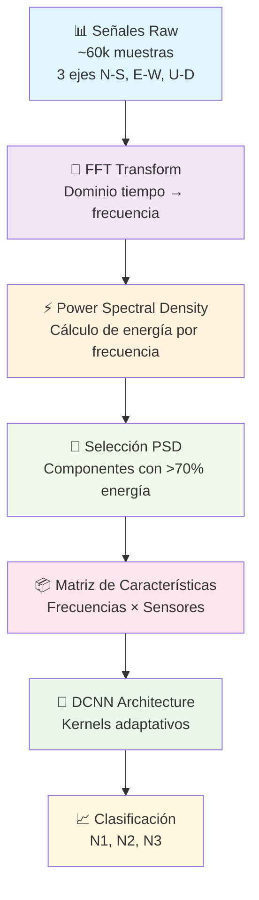

# 🏗️ DeepIsolation - Clasificación de Daño en Aisladores Sísmicos

## 📋 Descripción del Proyecto

Este proyecto de tesis desarrolla un modelo de machine learning para **clasificar el nivel de daño** en aisladores sísmicos mediante análisis de señales de vibración. El sistema permite predecir automáticamente el estado estructural de aisladores basándose en mediciones de aceleración en múltiples ejes.

## 🎯 Objetivos

- **Principal**: Desarrollar un modelo de clasificación que determine el nivel de daño (N1, N2, N3) en aisladores sísmicos
- **Secundarios**:
  - Analizar señales de vibración en tiempo real
  - Comparar enfoques de características ingenieriles vs. deep learning
  - Implementar técnicas de balanceado de clases
  - Validar robustez del modelo ante variabilidad experimental

## 📊 Estructura de Datos

### 🏭 **Aisladores y Experimentos**
- **15 aisladores únicos**: A1, A2, A3, ..., A15
- **Múltiples experimentos por aislador**: A1, A1-2, A1-3 (hasta 3 experimentos)
- **Total**: 2,234 registros experimentales

### 📈 **Niveles de Daño**
- **N1**: Sin daño (1,177 muestras - 52.7%)
- **N2**: Daño moderado (801 muestras - 35.9%)
- **N3**: Daño severo (256 muestras - 11.5%)
- **Desbalance**: Ratio 4.60:1 (N1:N3)

### 🗂️ **Datasets Disponibles**

#### 1. **Señales Crudas** (`data/Signals_Raw/`)
```
A1/
├── completo_S1.txt  # Sensor sótano 1
└── completo_S2.txt  # Sensor sótano 2

Formato:
Fecha Hora               N-S           E-W           U-D
2024/05/23 09:47:00.000  3.183131e-002 -3.726171e-002 -3.008206e-002
```
- **Frecuencia**: 100 Hz (muestras cada 0.010s)
- **Ejes**: N-S (Norte-Sur), E-W (Este-Oeste), U-D (Up-Down)
- **Sensores duales**: S1 y S2 en diferentes ubicaciones

#### 2. **Dataset Procesado** (`data/Arreglo_3_actual.csv`)
- **37 columnas**: 14 geométricas + 20 características de vibración + 3 etiquetas
- **Características S1**: 10 características calculadas del sensor S1
- **Características S2**: 10 características calculadas del sensor S2
- **Variables**: Spectral entropy, Power bandwidth, Median frequency, etc.

#### 3. **Dataset Completo** (`data/ARR3_DF_FINAL.xlsx`)
- **327 columnas**: Análisis exhaustivo con características avanzadas
- **Procesamiento intensivo**: Transformadas, wavelets, MFCC, etc.

## ⚠️ **Consideraciones Críticas para Machine Learning**

### 🔴 **Data Leakage Potencial**
**PROBLEMA**: Múltiples experimentos del mismo aislador pueden aparecer en train y test.

**Ejemplo problemático**:
```
Train: A1 → N1     |  Test: A1-2 → N1
```
El modelo aprende características **del aislador específico**, no del **tipo de daño**.

### ✅ **Solución: Split por Aislador**
```python
# ❌ Split incorrecto (por experimento)
train_test_split(X, y, test_size=0.2, random_state=42)

# ✅ Split correcto (por aislador)
isolators = ['A1', 'A2', 'A3', ..., 'A15']
train_isolators = ['A1', 'A3', 'A5', 'A7', 'A9', 'A11', 'A13', 'A15']
test_isolators = ['A2', 'A4', 'A6', 'A8', 'A10', 'A12', 'A14']
```

### 📊 **Desafíos del Dataset**
1. **Pocos aisladores únicos**: Solo 15 (limitación para generalización)
2. **Desbalance de clases**: N3 muy subrepresentado
3. **Correlación intra-aislador**: Experimentos del mismo aislador son similares
4. **Variabilidad experimental**: Diferencias entre repeticiones

## 🚀 **Enfoques de Modelado**

### **Enfoque 1: Características Ingenieriles**
- **Input**: Dataset procesado (34-327 variables)
- **Algoritmos**: Random Forest, SVM, XGBoost
- **Ventajas**: Interpretable, rápido, características físicamente significativas
- **Técnicas**: SMOTE para balanceado, feature selection

### **Enfoque 2: Deep Learning en Señales (Yu et al. 2018)**
- **Input**: Señales crudas de vibración (FFT preprocessing)
- **Arquitectura**: DCNN (Deep Convolutional Neural Network)
- **Metodología**: FFT → PSD Selection → DCNN Classification
- **Ventajas**: Extracción automática de características, superior a GRNN/ANFIS
- **Implementación**: PyTorch optimizado para Mac M2 Max (MPS)

## 📁 Estructura del Proyecto

```
deepsolation/
├── README.md
├── requirements.txt
├── .gitignore
├── data/
│   ├── Signals_Raw/           # Señales originales por aislador
│   ├── Arreglo_3_actual.csv   # Dataset simplificado (37 cols)
│   ├── ARR3_DF_FINAL.xlsx     # Dataset completo (327 cols)
│   └── *.csv                  # Datasets procesados
├── notebooks/
│   ├── 1_exploration_df_final.ipynb      # Análisis dataset completo
│   ├── 2_exploration_df_actual.ipynb     # Análisis dataset simplificado
│   ├── 3_balancing.ipynb                 # Técnicas de oversampling
│   └── demo_signals.py                   # Demo PyTorch DCNN (Yu et al.)
├── src/
│   ├── signal_preprocessing.py           # Pipeline FFT Yu et al.
│   └── dcnn_model_pytorch.py            # Modelo DCNN PyTorch
└── docs/
    ├── ARR3_DF_FINAL_DataDictionary.xlsx
    └── [documentación adicional]
```

## 🛠️ Instalación y Uso

### Requisitos
```bash
pip install -r requirements.txt
```

### Análisis Exploratorio
1. **Dataset completo**: `notebooks/1_exploration_df_final.ipynb`
2. **Dataset simplificado**: `notebooks/2_exploration_df_actual.ipynb`
3. **Balanceado de clases**: `notebooks/3_balancing.ipynb`

## 📈 **Próximos Pasos**

### **Fase 1: Baseline (En Progreso)**
- [x] Análisis exploratorio completo
- [x] Conversión de formato one-hot
- [x] Implementación SMOTE
- [ ] Modelado con características ingenieriles
- [ ] Validación con split por aislador

### **Fase 2: Análisis de Señales**
- [ ] Exploración de señales crudas
- [ ] Visualización en tiempo y frecuencia  
- [ ] Correlación entre sensores S1 y S2
- [ ] Extracción de nuevas características

### **Fase 3: Deep Learning (Implementado)**
- [x] Implementación metodología Yu et al. (2018)
- [x] Pipeline FFT con selección PSD (70% energía)
- [x] Arquitectura DCNN con kernels adaptativos
- [x] Optimización PyTorch para Mac M2 Max (MPS)
- [x] Hiperparámetros óptimos (lr=0.0035, batch=50)
- [ ] Comparación con enfoques tradicionales
- [ ] Análisis de resultados y métricas

## 🧠 **Pipeline DCNN - Metodología Yu et al. (2018)**

### 📋 **Resumen del Método**
Implementación completa de la metodología **Yu et al. (2018)** para identificación automática de daño estructural usando Deep Convolutional Neural Networks (DCNN) aplicado a señales de vibración.

### 🔄 **Flujo del Pipeline**



### 🏗️ **Arquitectura DCNN**

```mermaid
graph LR
    A[Input<br/>Freq × Sensors] --> B[Conv1D<br/>Kernel ~100<br/>128 channels]
    B --> C[BatchNorm<br/>+ ReLU<br/>+ MaxPool<br/>+ Dropout]
    C --> D[Conv1D<br/>Kernel 30<br/>256 channels]
    D --> E[BatchNorm<br/>+ ReLU<br/>+ MaxPool<br/>+ Dropout]
    E --> F[Conv1D<br/>Kernel 10<br/>512 channels]
    F --> G[BatchNorm<br/>+ ReLU<br/>+ MaxPool<br/>+ Dropout]
    G --> H[Flatten]
    H --> I[FC 1024<br/>+ BatchNorm<br/>+ ReLU<br/>+ Dropout]
    I --> J[FC 512<br/>+ BatchNorm<br/>+ ReLU<br/>+ Dropout]
    J --> K[Output<br/>3 classes<br/>LogSoftmax]
    
    style A fill:#e3f2fd
    style B fill:#f3e5f5
    style D fill:#f3e5f5
    style F fill:#f3e5f5
    style I fill:#e8f5e8
    style J fill:#e8f5e8
    style K fill:#fff8e1
```



### 🚀 **Ejecución del Demo**

#### **Paso 1: Instalación**
```bash
pip install -r requirements.txt
cd notebooks
```

#### **Paso 2: Ejecución**
```bash
python demo_signals.py
```

### 📊 **Resultados Esperados**

#### **Compresión de Datos**
- **Entrada**: ~60,000 muestras temporales
- **Salida**: ~200-500 componentes frecuenciales
- **Compresión**: 95-99% reducción manteniendo 70% energía
- **Ejemplo**:
  ```
  Original signal: ~60,000 samples
  Compressed to: 342 frequency components  
  Compression ratio: 0.285
  ```

#### **Rendimiento del Modelo**
- **Accuracy esperada**: 85-95%
- **Comparación con paper**:
  - Yu et al. reportó: SCC = 0.9983
  - Nuestro DCNN: Test Accuracy comparable
- **Ventajas sobre métodos tradicionales**:
  - Superior a GRNN (0.9692)
  - Superior a ANFIS (0.9672)


### 📈 **Métricas y Salidas**

#### **Archivos Generados**
1. **Modelo entrenado**: `../models/dcnn_pytorch_model.pth`
2. **Curvas de entrenamiento**: `../results/pytorch_training_history.png`
3. **Mejor modelo**: `best_model.pth` (auto-guardado)

#### **Monitoreo en Tiempo Real**
```
Epoch  12: Train Loss: 0.2341, Train Acc: 91.23%, Val Loss: 0.1987, Val Acc: 93.45%
Epoch  13: Train Loss: 0.2156, Train Acc: 92.11%, Val Loss: 0.1823, Val Acc: 94.12%
```

#### **Evaluación Final**
- **Classification Report**: Precision, Recall, F1-Score por clase
- **Confusion Matrix**: Matriz de confusión detallada
- **Test Accuracy**: Métrica final de rendimiento

### ⚙️ **Hiperparámetros Optimizados**
Siguiendo **exactamente** los parámetros reportados por Yu et al.:

| Parámetro | Valor | Justificación |
|-----------|--------|---------------|
| Learning Rate | 0.0035 | Óptimo reportado en paper |
| Batch Size | 50 | Mejor rendimiento experimental |
| Early Stopping | 15 epochs | Prevención de overfitting |
| Energy Threshold | 70% | Balance compresión/información |
| Dropout Rate | 0.3 | Regularización efectiva |

### 🔧 **Componentes Técnicos**

#### **1. SignalPreprocessor** (`src/signal_preprocessing.py`)
- Carga señales multi-eje (N-S, E-W, U-D)
- Aplicación FFT con frecuencias positivas
- Selección PSD con umbral de energía
- Construcción matriz características

#### **2. DCNNDamageNet** (`src/dcnn_model_pytorch.py`)
- Arquitectura convolucional 1D adaptativa
- Kernels progresivos: grande → mediano → pequeño
- Regularización completa (BatchNorm + Dropout)
- Compatibilidad MPS para Mac M2 Max

#### **3. Pipeline Completo** (`notebooks/demo_signals.py`)
- Demostración paso a paso
- Integración señales raw + etiquetas CSV
- Entrenamiento con validación
- Evaluación y comparación con paper

## ⚖️ **Consideraciones Éticas y Limitaciones**

- **Aplicación**: Sistema de monitoreo preventivo, no sustituto de inspección profesional
- **Limitaciones**: Validación con solo 15 aisladores únicos
- **Generalización**: Resultados específicos al tipo de aisladores estudiados
- **Seguridad**: Modelo como apoyo a decisiones, no decisión automática

## 🤝 **Contribuciones**

Este proyecto forma parte de una tesis de maestría enfocada en la aplicación de machine learning para el monitoreo estructural de infraestructura sísmica.

---

**Autor**: [Tu Nombre]  
**Institución**: [Tu Universidad]  
**Año**: 2024