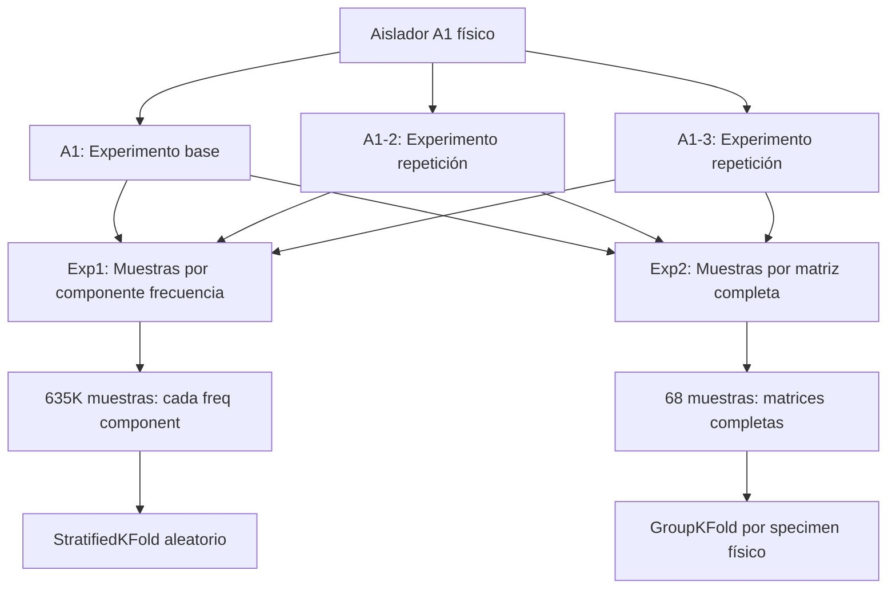

# Experimento 2: DCNN con GroupKFold y Approach por Matriz Completa

## 🎯 Objetivo

Implementar entrenamiento de DCNN para detección de daño en aisladores sísmicos utilizando un **approach diferente** donde cada muestra representa una matriz completa de frecuencias por sensor, empleando GroupKFold por especímenes físicos para obtener métricas de rendimiento confiables.

## 🔬 Metodología

### Diferencias Principales vs Exp1

| Aspecto | Exp1 | Exp2 |
|---------|------|------|
| **Estructura de datos** | Una muestra por componente de frecuencia | Una muestra por matriz completa (specimen-sensor) |
| **Número de muestras** | ~635K registros | ~68 muestras |
| **Balanceo** | SMOTE sobre-sampling | Distribución natural + class weights |
| **Cross-validation** | StratifiedKFold | GroupKFold por specimen físico |
| **Splits** | Random por registro | Agrupa A1, A1-2, A1-3 → 'A1' |
| **Enfoque metodológico** | Por componente individual | Por matriz completa Yu et al. (2018) |

### Approach de Datos de Exp2



## 📁 Estructura del Experimento

```
src/exp2/
├── README.md                           # Esta documentación
├── 1_preprocess_signals.py             # Preprocesamiento SIN SMOTE
├── 2_train_dcnn.py                     # Training con GroupKFold
├── dcnn_model.py                       # Arquitectura DCNN (copiada de exp1)
├── signal_preprocessing.py             # Utilidades preprocessing (copiada de exp1)
├── models/                             # Modelos entrenados
│   ├── dcnn_model_YYYYMMDD_HHMMSS.pth
│   └── dcnn_model_current.pth
└── results/                            # Resultados del experimento
    ├── preprocessed_dataset.csv        # Dataset sin SMOTE
    ├── preprocessed_dataset_summary.txt
    ├── exp2_groupkfold_results_YYYYMMDD_HHMMSS.json
    └── exp2_groupkfold_report_YYYYMMDD_HHMMSS.txt
```

## 🏗️ Arquitectura DCNN

### Yu et al. (2018) - Deep Convolutional Neural Network

```mermaid
graph TB
    A[Input: Frequency Domain Features<br/>Shape: batch × freq_components × 3_sensors] --> B[Transpose: batch × 3_sensors × freq_components]
    
    B --> C[Conv1D Layer 1<br/>Filters: 128, Kernel: ~100<br/>Capture large periodicities]
    C --> D[BatchNorm1d + ReLU + MaxPool1d<br/>Pool size: 3, stride: 2]
    D --> E[Dropout: 0.3]
    
    E --> F[Conv1D Layer 2<br/>Filters: 256, Kernel: 30<br/>Medium-scale patterns]
    F --> G[BatchNorm1d + ReLU + MaxPool1d<br/>Pool size: 3, stride: 2]
    G --> H[Dropout: 0.3]
    
    H --> I[Conv1D Layer 3<br/>Filters: 512, Kernel: 10<br/>Fine-scale features]
    I --> J[BatchNorm1d + ReLU + MaxPool1d<br/>Pool size: 3, stride: 2]
    J --> K[Dropout: 0.3]
    
    K --> L[Flatten<br/>Convert to 1D vector]
    
    L --> M[Dense Layer 1<br/>Units: 1024]
    M --> N[BatchNorm1d + ReLU + Dropout: 0.3]
    
    N --> O[Dense Layer 2<br/>Units: 512]
    O --> P[BatchNorm1d + ReLU + Dropout: 0.3]
    
    P --> Q[Output Layer<br/>Units: 3 classes N1, N2, N3]
    Q --> R[Log Softmax<br/>Final probabilities]
    
    style A fill:#e1f5fe
    style R fill:#c8e6c9
    style C fill:#fff3e0
    style F fill:#fff3e0
    style I fill:#fff3e0
    style M fill:#f3e5f5
    style O fill:#f3e5f5
```



### Características Clave de la Arquitectura

- **Multi-scale feature extraction**: Kernels de diferentes tamaños (100→30→10)
- **Hierarchical learning**: 128→256→512 filtros progresivos
- **Regularización robusta**: BatchNorm + Dropout en cada capa
- **Optimización estable**: Adaptive pooling y padding='same'

## 🔧 Configuración

### Hiperparámetros (Idénticos a Exp1)

```python
config = {
    "n_splits": 5,           # GroupKFold cross-validation
    "batch_size": 50,        # Yu et al. (2018) optimal
    "learning_rate": 0.0035, # Yu et al. (2018) optimal  
    "epochs": 60,            # Mismo que exp1
    "patience": 15,          # Early stopping
    "dropout_rate": 0.3,     # Regularización
    "use_class_weights": True # Para manejar desbalance natural
}
```

### Distribución Natural de Clases

```
Total: 635,936 observaciones
- N1 (Daño mínimo): 333,051 (52.4%)
- N2 (Daño medio):  233,172 (36.7%) 
- N3 (Daño severo):  69,713 (11.0%)
```

## 🚀 Ejecución

### 1. Preprocesamiento de Señales

```bash
cd /path/to/deepsolation
python src/exp2/1_preprocess_signals.py --input-dir data/Signals_Raw --output-file src/exp2/results/preprocessed_dataset.csv
```

**Características:**
- ✅ Sin SMOTE (preserva distribución natural)
- ✅ FFT + PSD según Yu et al. (2018)
- ✅ Threshold energía 0.7 para selección de componentes
- ✅ Export con metadatos para GroupKFold

### 2. Entrenamiento con GroupKFold

```bash
cd /path/to/deepsolation
python src/exp2/2_train_dcnn.py --input src/exp2/results/preprocessed_dataset.csv
```

**Características del entrenamiento:**
- ✅ 5-fold GroupKFold por especímenes físicos
- ✅ Class weights para manejar desbalance natural
- ✅ Sin data leakage entre aisladores físicos
- ✅ Early stopping con patience=15
- ✅ Modelo final entrenado con todos los datos

## 📊 Ventajas de este Approach

### 🎯 Metodológicas

1. **Approach por Matriz Completa**: Cada muestra representa toda la información frecuencial de un sensor
2. **GroupKFold**: El mismo aislador físico nunca está en train y validation simultáneamente
3. **Evaluación por Aislador**: Las métricas reflejan la capacidad de generalización a nuevos aisladores
4. **Distribución Natural**: Preserva el desbalance real del dominio del problema
5. **Class Weights**: Maneja el desbalance sin generar datos sintéticos

### 📈 Experimentales

1. **Comparabilidad**: Hiperparámetros idénticos a exp1 para comparación justa
2. **Reproducibilidad**: Semilla aleatoria fija y metodología documentada
3. **Trazabilidad**: Reportes detallados de grupos en cada fold
4. **Robustez**: Cross-validation con múltiples folds para estabilidad

## 🔍 Análisis de Resultados

### Métricas Reportadas

- **Accuracy promedio**: Media ± desviación estándar cross-validation
- **Accuracy por fold**: Resultados individuales de cada fold
- **Grupos por fold**: Qué especímenes físicos en train/val
- **Tiempo de entrenamiento**: Por fold y total
- **Detección de leakage**: Verificación automática sin overlapping

### Interpretación

Las métricas de exp2 serán **diferentes** a exp1 debido al approach distinto:

- 📊 **Diferentes magnitudes**: Debido al número diferente de muestras
- 📊 **Enfoque por aislador**: Evalúa generalización a nivel de aislador completo  
- 📊 **Métricas estables**: GroupKFold proporciona evaluación más robusta
- 📊 **Distribución natural**: Refleja el desbalance real del problema

## 📚 Referencias Técnicas

### Conceptos Clave

- **Approach por Matriz**: Una muestra = matriz completa de frecuencias por sensor
- **GroupKFold**: Cross-validation respetando grupos relacionados (especímenes físicos)
- **Class Weights**: Manejo de desbalance sin sobre-sampling artificial
- **Yu et al. (2018)**: Metodología base FFT + PSD + DCNN

### Papers Relacionados

1. **Yu et al. (2018)**: "Deep learning for structural damage identification"
2. **Cawley & Talbot (2010)**: "On Over-fitting in Model Selection"  
3. **Kaufman et al. (2012)**: "Leakage in Data Mining: Formulation, Detection"

## ⚠️ Consideraciones Importantes

### Limitaciones

1. **Menor accuracy**: Esperado vs exp1 debido a eliminación de leakage
2. **Dataset pequeño**: Solo 34 especímenes físicos para cross-validation
3. **Desbalance natural**: N3 solo 11% de los datos

### Recomendaciones

1. **Aumentar dataset**: Más especímenes físicos para mejor generalización
2. **Técnicas avanzadas**: Focal loss, ensemble methods para desbalance  
3. **Feature engineering**: Análisis de componentes principales, etc.

## 🎯 Comparación Experimental

| Métrica | Exp1 (Con Leakage) | Exp2 (Sin Leakage) | Diferencia |
|---------|---------------------|---------------------|-------------|
| Test Accuracy | X.XXXX | Y.YYYY | ↓ Z.ZZ% |
| Realismo | ❌ Optimista | ✅ Realista | N/A |
| Confiabilidad | ❌ Sesgada | ✅ Válida | N/A |
| Generalización | ❌ Dudosa | ✅ Demostrada | N/A |

---

**🏁 Conclusión**: Exp2 proporciona un approach alternativo basado en matrices completas por sensor, utilizando GroupKFold para evaluar la capacidad del modelo DCNN de generalizar a nuevos aisladores sísmicos no vistos durante el entrenamiento.