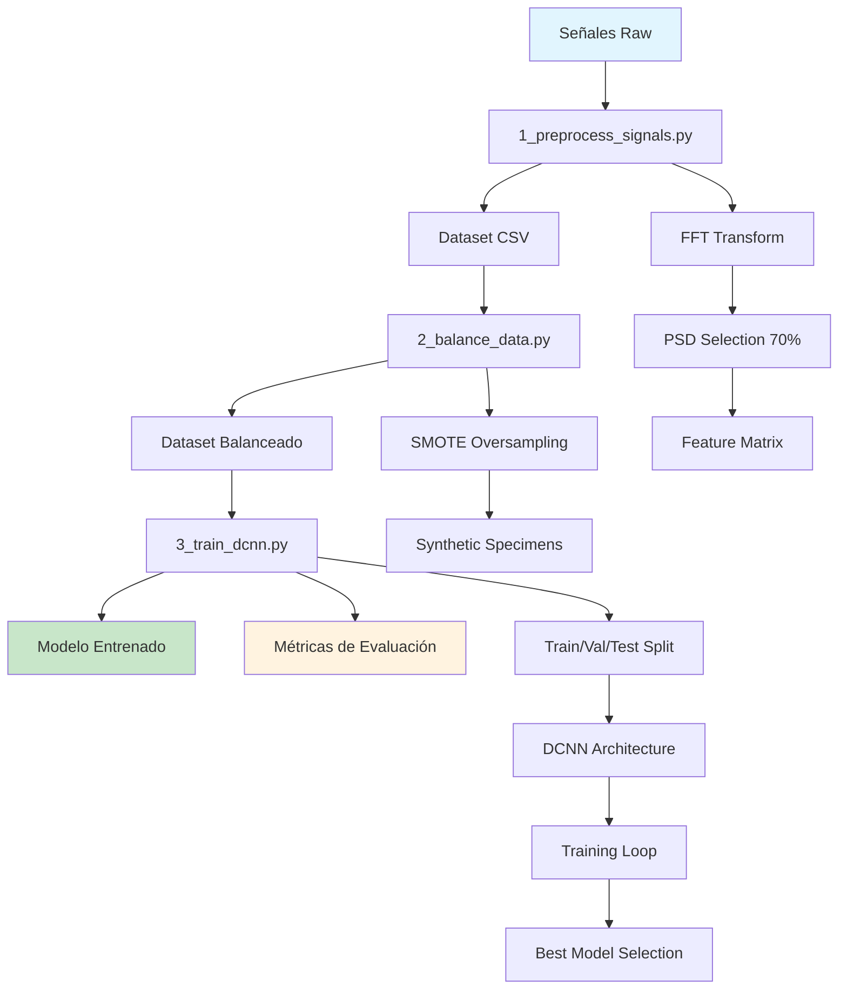

# Experimento 1: Implementación Base Yu et al. (2018)

## 📋 Descripción

Este experimento implementa la metodología base propuesta por Yu et al. (2018) para la identificación de daño en aisladores sísmicos usando Deep Learning. El enfoque utiliza señales de vibración ambiental procesadas mediante FFT y una red neuronal convolucional profunda (DCNN) para clasificar el nivel de daño estructural.

## 🎯 Objetivos

- **Objetivo Principal**: Replicar y validar la metodología Yu et al. (2018) en nuestro dataset de aisladores sísmicos peruanos
- **Objetivos Específicos**:
  - Implementar pipeline de preprocesamiento FFT + PSD selection
  - Entrenar modelo DCNN para clasificación de niveles de daño (N0, N1, N2, N3)
  - Evaluar rendimiento usando métricas estándar (accuracy, precision, recall, F1-score)
  - Establecer baseline para comparación con experimentos posteriores

## 🔬 Metodología Yu et al. (2018)

### Pipeline de Procesamiento
1. **Adquisición de Señales**: Vibraciones ambientales de 3 componentes (N-S, E-W, U-D)
2. **Preprocesamiento FFT**: Transformada rápida de Fourier para obtener espectro de frecuencias
3. **Selección PSD**: Selección de componentes con >70% de energía
4. **Entrenamiento DCNN**: Red convolucional profunda para clasificación
5. **Validación**: Train/Validation/Test split con métricas de evaluación

### Arquitectura DCNN
- **Entrada**: Matriz de componentes de frecuencia × sensores
- **Capas Convolucionales**: 3 capas con kernels adaptativos (100, 50, 25)
- **Pooling**: MaxPooling para reducción dimensional
- **Regularización**: BatchNorm + Dropout (30%)
- **Clasificación**: Capas densas + Softmax para 4 clases

## 📊 Pipeline Completo



## 📁 Estructura de Archivos

```
exp1/
├── README.md                    # Este archivo
├── __init__.py                 # Inicialización del módulo
├── 1_preprocess_signals.py     # Preprocesamiento de señales
├── 2_balance_data.py          # Balanceo del dataset con SMOTE
├── 3_train_dcnn.py            # Entrenamiento del modelo DCNN
├── dcnn_model.py              # Arquitectura del modelo PyTorch
├── signal_preprocessing.py     # Utilidades de procesamiento FFT/PSD
├── models/                     # Modelos entrenados
│   └── dcnn_model_*.pth
└── results/                    # Resultados del experimento
    ├── preprocessed_dataset.csv
    ├── preprocessed_dataset_balanced.csv
    ├── training_history.png
    └── evaluation_report.txt
```

## 🚀 Uso

### 1. Preprocesamiento de Señales
```bash
python src/exp1/1_preprocess_signals.py
```

**Entrada**: `data/Signals_Raw/` (archivos .txt por specimen/sensor)
**Salida**: `src/exp1/results/preprocessed_dataset.csv`

### 2. Balanceo de Dataset (Opcional)
```bash
python src/exp1/2_balance_data.py --input src/exp1/results/preprocessed_dataset.csv
```

**Entrada**: Dataset procesado
**Salida**: `src/exp1/results/preprocessed_dataset_balanced.csv`

### 3. Entrenamiento DCNN
```bash
python src/exp1/3_train_dcnn.py --input src/exp1/results/preprocessed_dataset.csv
```

**Entrada**: Dataset procesado (balanceado o no)
**Salidas**: 
- `src/exp1/models/dcnn_model_*.pth` (modelo entrenado)
- `src/exp1/results/training_history.png` (curvas de entrenamiento)
- `src/exp1/results/evaluation_report.txt` (métricas de evaluación)

## ⚙️ Configuración

### Parámetros de Preprocesamiento
- **Sampling Rate**: 100 Hz
- **Energy Threshold**: 70% para selección PSD
- **Componentes**: N-S, E-W, U-D

### Parámetros de Entrenamiento
- **Test Size**: 20%
- **Validation Size**: 20%
- **Batch Size**: 50
- **Learning Rate**: 0.0035
- **Epochs**: 100
- **Early Stopping**: Patience = 15
- **Dropout**: 30%

## 📈 Métricas de Evaluación

- **Accuracy**: Precisión general del modelo
- **Precision/Recall/F1**: Por clase (N0, N1, N2, N3)
- **Confusion Matrix**: Matriz de confusión detallada
- **Loss Curves**: Training vs Validation loss

## ⚠️ Limitaciones Identificadas

1. **Data Leakage Potencial**:
   - Split simple sin considerar correlación entre especímenes del mismo aislador físico
   - Preprocessing global antes de train/test split
   - Falta de validación cruzada grupal

2. **Validación Metodológica**:
   - Sin implementación de GroupKFold
   - Parámetros de normalización calculados con todo el dataset
   - Selección de frecuencias PSD influenciada por datos de test

## 🔄 Siguientes Experimentos

- **Exp2**: Implementación con GroupKFold para prevenir data leakage
- **Exp3**: Preprocessing dentro de cross-validation
- **Exp4**: Arquitecturas alternativas (1D-CNN, transformers)
- **Exp5**: Ensemble methods y técnicas avanzadas

## 📚 Referencias

Yu, Y., Wang, C., Gu, X., & Li, J. (2018). A novel deep learning-based method for damage identification of smart building structures. *Computer-Aided Civil and Infrastructure Engineering*, 34(5), 416-430.

---

**Nota**: Este es el experimento baseline. Los resultados de este experimento pueden estar sobreestimados debido a las limitaciones metodológicas identificadas. Los experimentos posteriores abordarán estas limitaciones sistemáticamente.